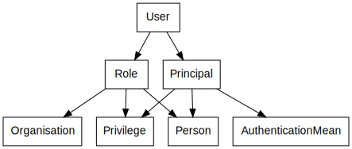

# Security Model

## The entities

This packages conceptualizes the basic entities of the security model of
our system:

* **Principal** is someone who can be authenticated (by, e.g., a password)
* **Person** is someone who bears a natural identity (with, e.g., a name, or birthdate)
* **Privileges** is what is allowed to be done
* **Organisation** is a body of persons, formed for a self-given purpose
* **Role** is what a person plays in an organisation
* **AuthenticationMean** is anything a principal can be authenticated by

We distinguish between `Principal` and `Person`, because in our system persons
can be both parents and children, where one or more parents may authenticate
on behalf of one or more children. Principals are for placing security concerns,
persons are for placing domain concerns.

To better deal with that split in practice, another entity is defined:

* **User** is the combination of both a principal and a person

## A word on relations and generic typing

In this basic model, relations are specified in one direction only,
avoiding circular references. Implementations may introduce backward
references (OR mappers may support these conveniently).

Because of this one-way linking, not all relations are fully
expressed. For example, while the model clearly shows that a
principal may relate to a number of persons, it is not visible
that a person may legally have more than one principal.

Relations are expressed by getters on the entities. To relieve
the implementors and users of this model from tedious type-casting,
generic parameters have been specified for entities with getters.
And since ultimately all entities of this model are linked to each
other, each generic entity requires the complete parameter list,
which may look a bit scarry at first. To mitigate the scare factor,
two measures where taken:

* the generic parameter list is copy-paste, so it looks the same
on each entity
* there is an example implementation in the test folder, you may
copy from that to get started

The generic parameters appear only on the interfaces in this model.
Once you implement them in your own classes, they will disappear.
